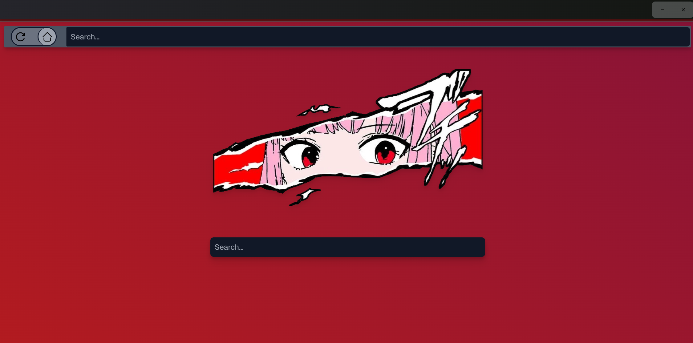
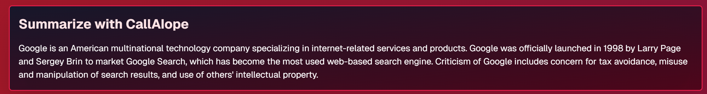

## About

**Reaper Browser** is an Unofficial Web Browser inspired by Calliope Mori!
### ✨ Highlights

- 💡 Calli-inspired Aesthetic themed after Death's apprentice herself!
- 💠 Chillingly fast search results that pop up as quickly as Calli spits a verse!
- 🤖 CallAIope, the AI Summariser that reaps the pure info from your search results!
  (NOTE: Please look to the dev instructions and use a token of your own for this feature. CallAIope will be disabled for the User Build currently.)

Reaper Browser v1.0 is a hobby browser created using Tauri and NextJS for lightweight and rapid performance, but it's not going to replace your normal browser just yet!

---
## Features

### 💡 Theme
A strikingly bloodthirsty theme inspired by Calliope Mori, crafted with TailwindCSS. It's pretty cool.

### 💠 Search functionality
Results scraped from the DuckDuckGo API, giving speedy results with every search. It's kinda scuffed for now but stay tuned as it improves.

### 🤖 AI Summary
CallAIope is the AI summary widget that gathers data from your query and results to form a concise stanza of information.
It runs on Facebook's bart-large-cnn model which was trained on CNN news materials. It does show the occasional bug though.

### 🎨 Art Credit
The source image for Reaper Browser's startpage logo is from UDTee: https://www.redbubble.com/people/udtee/shop

---

## Gallery 📸





---
## Installation

### User
Download the corresponding folder in Releases.
#### Windows
Run the .msi installer and allow the app to run. You may need to grant admin to install the app in your Program Files.
#### MacOS
Run the .dmg or the app directly. It is common to receive the error: "The app is damaged."
Bypass this by opening your terminal and typing:
```sudo xattr -rd com.apple.quarantine {APP_PATH_HERE}```
You can also drag and drop the app from Finder to the terminal to input the file path instantly.
If successful, you should be able to run the app normally. 
NOTE: You cannot drag the window for some reason, fix coming soon.

### Development
If you're looking to modify, fork or simply take a peek at Reaper Browser's code, download the source code and open the project in your IDE of choice (I'm using WebStorm).
You can then browse the code for Reaper Browser.

Remember to add your own HuggingFace token/API key if you're looking to modify CallAIope AI Summary.


To run a development session:
```npm run tauri dev```
To build:
```npm run tauri build```

---

## Credits

Thanks, of course, to Mori Calliope of Hololive English Myth for her design influence and inspiration!

Resources used for Reaper Browser Version 1.0:


Lastly, thank you for trying out Reaper Browser, the Deadliest Browser in the Underworld!
---

#### Reaper Browser by EasybuttonDev